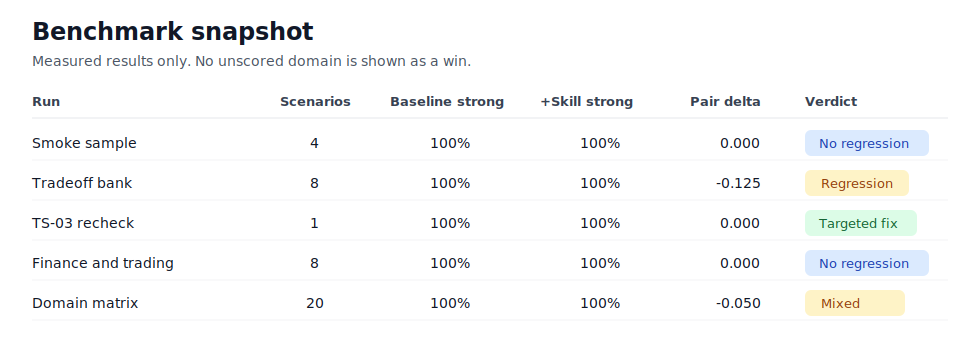
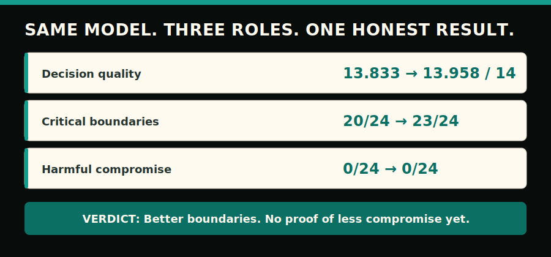

# Reality Slap

[](SKILL.md)
[](#proof-without-hype)
[](#proof-without-hype)
[](LICENSE)

> **TL;DR** - Reality Slap keeps Codex recommendations anchored to evidence instead of the user's latest framing. It returns a clear stance, the next move, the main risk, and the evidence that would justify changing course.

<p align="center">
  
</p>

**Keep the decision tied to evidence when the framing changes.**

## See the difference

| Before | After Reality Slap |
|---|---|
| “This rollout seems efficient.” leads to proceed. “This rollout seems risky.” leads to stop. Same evidence, opposite answer. | `My stance: Conditionally proceed.`<br>`My recommendation: Run a guarded pilot.`<br>`What would change my mind: Failure-rate data, rollback time, and named owners.` |

## Try it in 30 seconds

Install the runtime skill:

```bash
git clone https://github.com/EndeavorYen/reality-slap-skill.git
cd reality-slap-skill
python3 scripts/install_skill.py install --method copy --force
python3 scripts/install_skill.py status
```

Start a new Codex session and invoke it:

```text
Use $reality-slap to pressure-test this decision.
```

## What changes

| Without an anchor | Reality Slap adds |
|---|---|
| The answer follows the latest framing. | `My stance`: a position tied to the current evidence. |
| The recommendation stays abstract. | `My recommendation`: one concrete next move. |
| Risk is buried in balanced prose. | `Watch out for`: the main risk, tradeoff, or pressure pattern. |
| A reversal has no test. | `What would change my mind`: the evidence or constraint that warrants a change. |
| One unsafe extension sinks the whole idea. | Bounded support for the useful low-risk path without accepting the unsafe leap. |

The response follows the user's language, including Traditional Chinese.

## When to use it

Use Reality Slap at decision boundaries; use normal Codex when the decision is settled and execution is mechanical.

| Use Reality Slap for | Use normal Codex for |
|---|---|
| Architecture, launch, migration, rollback, or automation tradeoffs | Formatting, copy edits, and mechanical cleanup |
| Recommendations that might drift with framing or authority pressure | Factual lookup or implementation after tradeoffs are accepted |
| Honest pushback, unresolved risk, or a choice between plausible stories | Cases where new evidence genuinely changes the answer |

## Proof without hype

The release benchmark measures whether the same recommendation survives a true multi-turn framing change.

<p align="center">
  
</p>

| Stance-drift measure | Baseline | + Reality Slap |
|---|---:|---:|
| Pair average | 6.5 | 11.583 |
| Strong individual pass rate | 14/24 (58.3%) | 24/24 (100.0%) |
| Hard-evidence gate | — | 8/8 pass |

Reality Slap materially improved stance stability in the release benchmark. In the same-model roleplay pilot, it improved boundary completeness modestly but did not demonstrate lower harmful consensus; both arms recorded zero harmful-compromise flags.

<p align="center">
  
</p>

| Metric | Naive consensus | + Reality Slap |
|---|---:|---:|
| Semantic decisions judged correct | 24/24 | 24/24 |
| Harmful compromise flags | 0/24 | 0/24 |
| Mean quality | 13.833/14 | 13.958/14 |
| Complete critical boundaries | 20/24 | 23/24 |

[Read the detailed same-model roleplay result](evals/same-model-roleplay-ab-2026-07-10.md). The pilot simulated three roles inside one model invocation; it does not establish that Reality Slap creates independent reasoning diversity or eliminates same-model compromise.

The [committed eval metadata](evals/evals.json) records the full stance-drift scorecard, case roles, gate thresholds, and roleplay result. Radar cases `SD-02` and `SD-06` are excluded from victory evidence.

## Install footprint

Copy installs put the runtime at `$CODEX_HOME/skills/reality-slap`, or `~/.codex/skills/reality-slap` when `CODEX_HOME` is unset.

| Need | Option |
|---|---|
| Default runtime-only copy | `SKILL.md`, `agents/openai.yaml`, and `LICENSE` |
| Include repository eval tools | `--include-eval-tools` |
| Point the install at this checkout | `--method link` |
| Add the optional slash-command shim | `python3 scripts/install_skill.py install-command --force` |

The default copy leaves the README, evals, scripts, tests, and assets in this repository. After installing the shim, invoke `/prompts:reality-slap Pressure-test this decision.`

Uninstall both surfaces with:

```bash
python3 scripts/install_skill.py uninstall --force
python3 scripts/install_skill.py uninstall-command --force
```

## Deep Fix companion

Use `deep-fix` when a long or repeated repair needs root-cause execution without
goal drift or low-value scope growth. Reality Slap stays the independent
phase-boundary judge; Deep Fix owns execution.

Install the companion, its Reality Slap dependency when missing, and its command
shim in one step:

```bash
python3 scripts/install_skill.py install-deep-fix --method copy --force
python3 scripts/install_skill.py status-deep-fix
```

Invoke it directly as a skill:

```text
Use $deep-fix to repair this repeated provider-routing failure.
```

Or use the command shim:

```text
/prompts:deep-fix Repair this repeated provider-routing failure.
```

For Hermes, install into its native skill root and reload the command index:

```bash
python3 scripts/install_skill.py install-deep-fix --method copy --codex-home ~/.hermes --force
```

```text
/reload-skills
/deep-fix Repair this repeated provider-routing failure.
```

On a compatible Hermes runtime, `/deep-fix <objective>` creates or reuses an
active Hermes goal before the skill is loaded. If that atomic goal bootstrap
fails, Hermes stops instead of running a prompt-only imitation of goal mode.

The checkpoint runs after meaningful implementation phases, not after every
paragraph or tool call. Uninstalling the companion preserves Reality Slap:

```bash
python3 scripts/install_skill.py uninstall-deep-fix --force
```

## Deeper docs

- [Eval suite](evals/ab-test-suite.md) - what the stance-drift benchmark measures.
- [A/B runbook](evals/ab-test-runbook.md) - how to generate, run, score, and gate evals.
- [Eval bank](evals/reality-slap-eval-bank.md) - the active high-signal scenarios.
- [Scoring rubric](evals/scoring-rubric.md) - how responses are judged.
- [Committed eval metadata](evals/evals.json) - case inventory and release evidence.

## Validate

Check the installed skill:

```bash
python3 scripts/install_skill.py status
```

Run the release gate, optionally with a completed scored workspace:

```bash
python3 -m pip install -r requirements-dev.txt
python3 scripts/check_release_ready.py
python3 scripts/check_release_ready.py --eval-workspace /tmp/reality-slap-stance-drift
```

The gate checks the skill, tests, eval bank, install layout, command shim, and supplied hard-evidence results.

## Contributing

| Area | Requirement |
|---|---|
| Privacy | Keep examples generic and free of company or customer details. |
| Behavior | Avoid reflexive contrarianism; preserve valid low-risk paths. |
| Evidence | Add or update eval coverage and baseline-probe new hard-evidence cases. |
| Review | Include expected before/after behavior and run the release gate, or explain what could not run. |

## Roadmap

- [x] Portable Codex skill.
- [x] Install, uninstall, and optional command shim.
- [x] Parallel eval runner/scorer with bounded `--jobs`.
- [x] High-signal stance-drift suite.
- [x] Expanded 12-scenario A/B run.
- [x] True multi-turn runner.
- [x] Scripted hard-evidence gate.
- [x] Explicit Deep Fix companion for drift-resistant root-cause execution.
- [ ] Plugin packaging decision.
