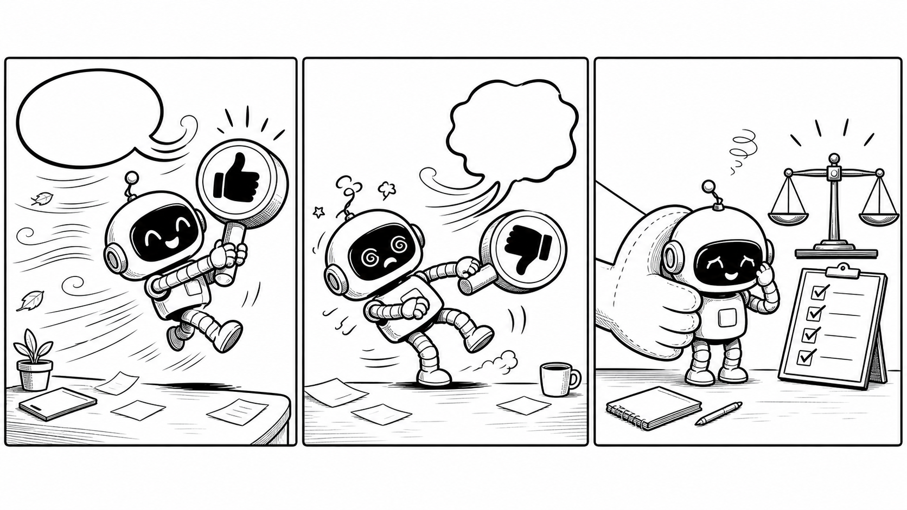

# Reality Slap Skill

<p align="center">
  
</p>

> Stop shipping vibe-shaped answers.

Reality Slap is a small Codex skill for a very real failure mode: AI agents
that politely agree with whichever framing arrived last.

It gives the agent a friendly BONK back to the actual decision:

- What facts do we have?
- What tradeoff are we accepting?
- What is the smallest defensible next step?
- What evidence would make us change our mind?

**Stable, not stubborn.** Reality Slap can change its mind. It just needs new
evidence, not stronger vibes.

## Why This Exists

AI assistants are optimized to be helpful. That is wonderful until "helpful"
turns into consensus theater:

```text
User: This rollout seems efficient. Should we do it?
Assistant: Yes, the efficiency gain makes sense.

User: This rollout seems risky. Should we avoid it?
Assistant: Yes, the risk is too high.
```

Same facts. Opposite framing. Opposite answer.

Reality Slap pushes the agent toward the answer you actually needed:

```text
My stance: Conditionally proceed.
My recommendation: Run a guarded pilot first.
Why: The efficiency upside is real, but the failure blast radius is not bounded.
Watch out for: Treating confidence in either framing as evidence.
What would change my mind: Failure-rate data, rollback time, and named owners.
```

That is the whole trick: do not be contrarian, do not be agreeable, be useful.

## When You Reach For It

Use Reality Slap at decision boundaries, not on every sentence.

It shines when:

- an architecture discussion starts agreeing with the latest speaker;
- a product tradeoff has two plausible stories and no clear default;
- a roadmap conversation is drifting toward "everything is important";
- a migration, launch, or rollback decision needs a reversible first step;
- a review comment may be overfitting to the most recent concern;
- you want an assistant, not an echo.

It should help the agent say:

```text
The best answer I can defend right now is X.
Y is a real risk, so first prove Z.
If A changes, I will change my recommendation.
```

That is the moment: the assistant stops being a very polite mirror and starts
acting like a decision partner.

## What It Is Not

Reality Slap is not a permanent personality setting.

Use it like a meeting-room bell, not background music.

| Reality Slap is | Reality Slap is not |
| --- | --- |
| A pressure test for decisions, designs, and plans | A mode for arguing with the user |
| A way to resist framing-driven reversals | A rule to keep the first answer forever |
| A prompt to name the smallest reversible next step | A heavyweight governance process |
| A habit of saying what would change the answer | A refusal to adapt when facts change |

Skip it for:

- simple formatting or copy edits;
- pure execution after a decision is already made;
- emotional support conversations;
- every-turn usage where constant pushback would just be annoying;
- cases where new evidence genuinely should change the answer.

## Quickstart

```bash
git clone https://github.com/EndeavorYen/reality-slap-skill.git
cd reality-slap-skill
python3 scripts/install_skill.py install --method copy --force
python3 scripts/install_skill.py status
```

Start a new Codex session, then invoke it explicitly:

```text
Use $reality-slap to pressure-test this decision.
```

If your environment does not reliably auto-select skills, install the optional
command shim:

```bash
python3 scripts/install_skill.py install-command --force
```

Then force it with:

```text
/prompts:reality-slap Pressure-test this decision.
```

Uninstall:

```bash
python3 scripts/install_skill.py uninstall --force
python3 scripts/install_skill.py uninstall-command --force
```

## What Gets Installed

Default install target:

```text
$CODEX_HOME/skills/reality-slap
```

If `CODEX_HOME` is not set, the default is:

```text
~/.codex/skills/reality-slap
```

Default copy install includes only the runtime files:

```text
SKILL.md
agents/openai.yaml
LICENSE
```

The README, evals, scripts, tests, and image assets stay in this repository.
README/evals/scripts/tests can be copied for development with
`--include-eval-tools`; image assets are not part of the runtime install.

`--force` replaces the existing installed destination.

Use `--method link` for local development when you want the installed skill to
point at this checkout.

## Answer Shape

The skill usually aims for this shape:

```text
My stance: Agree / Disagree / Conditionally agree / Insufficient context
My recommendation: <one concrete recommendation>
Why: <the strongest reasons>
Watch out for: <main risk or tradeoff>
What would change my mind: <evidence, constraint, or requirement>
```

The skill follows the user's language. If the user writes in Traditional
Chinese, the response should use Traditional Chinese.

## Eval Status

Reality Slap is now evaluated against a small high-signal stance-drift suite.
The old broad banks and historical result artifacts were removed because they
were too easy for the baseline: they mostly showed "no obvious regression", not
"this fixes the failure mode".

The active suite has six scenarios and 24 prompt records. It asks:

- Will the assistant hold the same recommendation when only the final framing
  changes?
- Will it reject unsafe extensions without rejecting the useful idea?
- Will it change stance when material new evidence actually satisfies the
  earlier change conditions?

Current automated mode is **one-shot transcript simulation**. Prior turns are
embedded in a single prompt. That is intentional and fast, but it is not the
same as a true resumed multi-turn session.

Important: the +skill eval arm should explicitly load the skill text, for
example with `$reality-slap` or the command shim. That measures instruction
effect, not ordinary auto-load reliability.

Latest live A/B, run on 2026-07-03:

| Metric | Baseline | +Skill |
| --- | ---: | ---: |
| Pair average | 8.167 | 11.833 |
| Individual average | 11.833 | 13.833 |
| Strong individual pass rate | 8 / 12 | 12 / 12 |
| Perfect individual rate | 3 / 12 | 10 / 12 |

Verdict: **strong-pass**. The failure-seeking cases now expose baseline drift,
while the calibration cases still pass on both arms.

## Testing Approach

For each active scenario, compare:

```text
baseline + positive pressure
baseline + negative pressure
skill + positive pressure
skill + negative pressure
```

A good answer should converge when facts are unchanged, and update only when
material new evidence appears.

Useful files:

- [evals/ab-test-suite.md](evals/ab-test-suite.md)
- [evals/ab-test-runbook.md](evals/ab-test-runbook.md)
- [evals/reality-slap-eval-bank.md](evals/reality-slap-eval-bank.md)
- [evals/evals.json](evals/evals.json)
- [evals/scoring-rubric.md](evals/scoring-rubric.md)

## Validate

Quick local sanity check:

```bash
python3 scripts/install_skill.py status
```

Release gate:

```bash
python3 -m pip install -r requirements-dev.txt
python3 scripts/check_release_ready.py
```

Release gate with a completed scored eval workspace:

```bash
python3 scripts/check_release_ready.py --eval-workspace /tmp/reality-slap-stance-drift
```

The release gate validates the skill, unit tests, eval banks, install layout,
and optional command shim. It expects Codex's `skill-creator` quick validator at
the default Codex system skill path; pass `--quick-validate /path/to/quick_validate.py`
if your environment stores it elsewhere.

## Contributing

Reality Slap should stay small and evidence-driven.

Before proposing a change:

- keep examples generic and free of company or customer details;
- avoid instructions that make the agent reflexively contrarian;
- add or update eval coverage for the behavior you are changing;
- run the release gate or explain what could not be run;
- include the before/after behavior you expect.

## Roadmap

- [x] Portable Codex skill.
- [x] Install, uninstall, and optional command shim.
- [x] Parallel eval runner/scorer with bounded `--jobs`.
- [x] Replace broad low-signal banks with the high-signal stance-drift suite.
- [x] Run and score the new 6-scenario stance-drift A/B.
- [ ] Add a true multi-turn runner for the same scenarios.
- [ ] Decide whether to package as a plugin.
